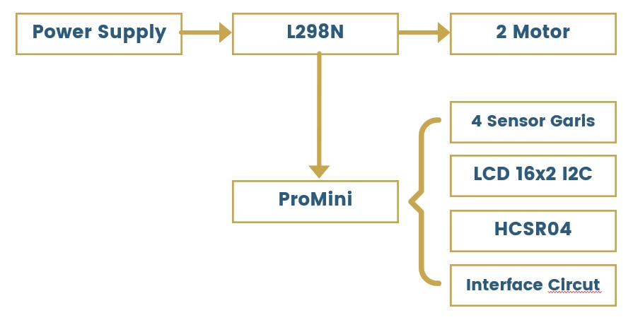
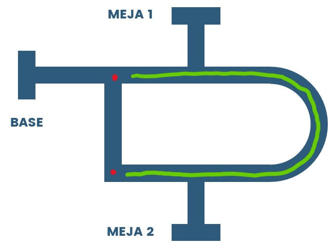
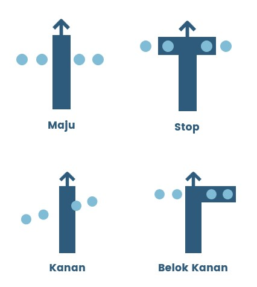
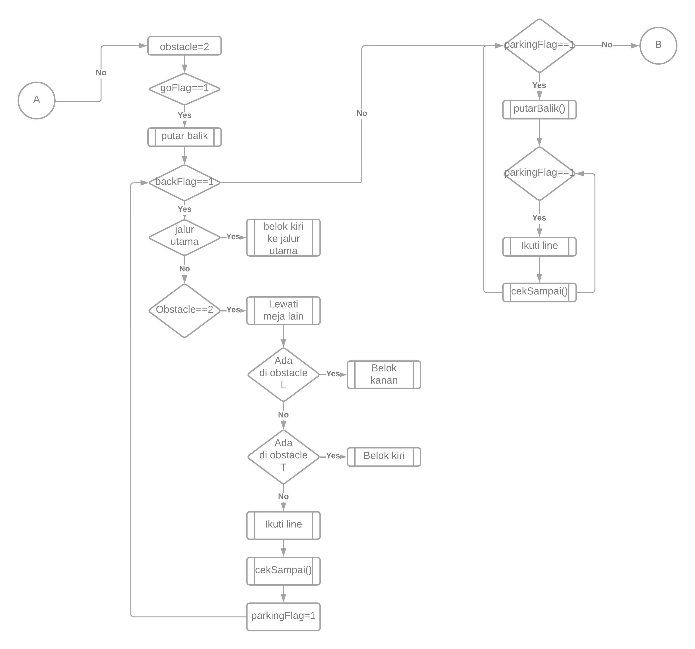
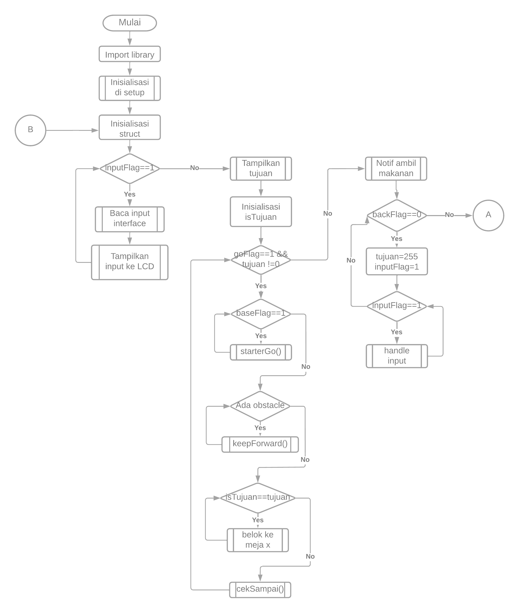

# Food Serving Robot

## Table of Contents

- [About](#about)
- [Flowchart](#flowchart)
- [Usage](#usage)

## About 
Berikut ini adalah diagram rangkaian robot:

Robot ini dibuat berdasarkan beberapa ketentuan:
- Denah seperti yang ditentukan programmer
- Meja dapat ditambahkan sepanjang jalur yang diberi tanda hijau
- Robot selalu melewati meja 1

Berikut ini adalah dasar anggota gerak robot:

## Flowchart 

## Usage 
Terdapat 3 input tombol, yaitu:
- nomor meja (kiri user)
- reset nomor meja (tengah)
- submit (kanan)
Asumsi user berhadapan dengan robot. User hanya perlu mengikuti apa yang ditampilkan pada layar LCD.

Tahapan:
1. Robot dalam kondisi standby
2. Sensor HCSR04 mendeteksi orang yang mendekat
3. Koki memberi input meja tujuan, lalu klik submit
4. Robot menuju meja tujuan
5. Pelanggan mengambil makanan, lalu klik submit
6. Robot menuju ke base
7. Robot dalam mode stanby
